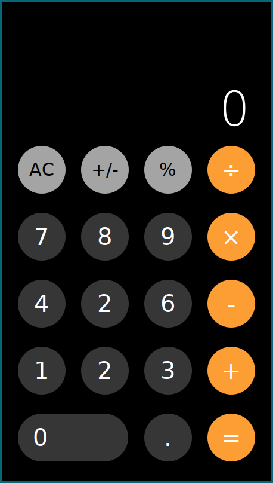
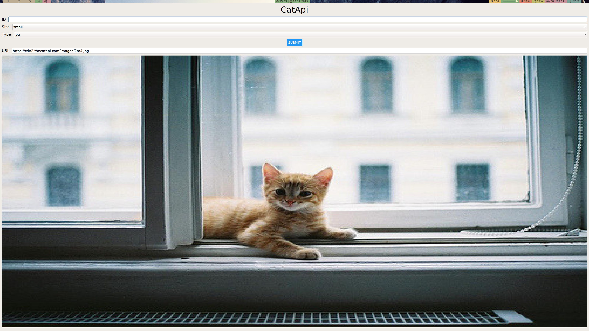

  
  Logo by <a href="https://twitter.com/elisiri_">@elisiri</a>

Create desktop applications through a React syntax, on all platforms.

## V2 is released!

V2 has been released and it brings a whole host of improvements including new
components that are identical to React Native, styling, flexbox, hot reloading,
and more. You can read the full writeup [here](https://proton-native.js.org/#/v2_changes).
To try it out, visit the documentation for instructions on how to get started!

## Features

- Same syntax and components as React Native
- Works with existing React libraries such as Redux
- Cross platform
- No more Electron
- Compatible with all normal Node.js packages
- Hot reloading

## Images

## [Documentation](https://proton-native.js.org)

See the documentation for how to get started and details on all the components.

## Examples

Examples can be found in [`examples/`](https://github.com/kusti8/proton-native/tree/master/examples).

## Contributing

All contributions are welcome. Just make a PR.

<a href="https://www.keycdn.com/">Accelerated by KeyCDN</a>
