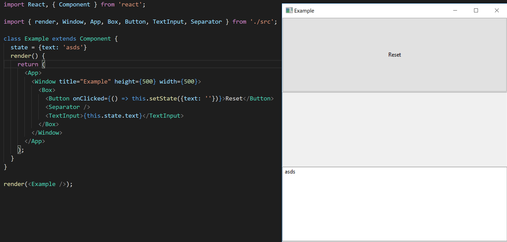

  

Create native desktop applications through a React syntax, on all platforms

## Features

- Same syntax as React Native
- Works with existing React libraries such as Redux
- Cross platform
- Native components. No more Electron

## Images

## [Documentation](https://proton-native.js.org)

See the documentation for how to get started and details on all the components.

## Examples

Examples can be found in `examples/`.

## Contributing

All contributions are welcome. Just make a PR. Below is a list of general improvements that need to be added that I would love help with:

- More examples and improve documentation
- Add UiArea
- Clean up code
- Make packaging easier
- Make creating a new app easier (something similar to `create-react-app`)