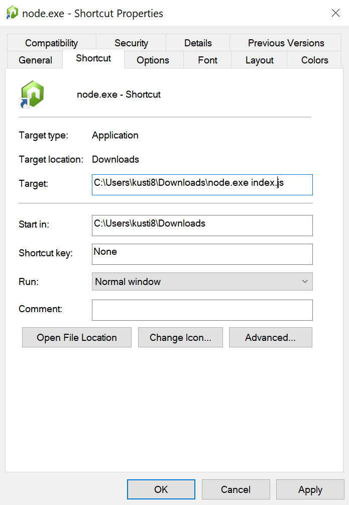

# Packaging

Currently, the node packaging/compiling world has gotten a lot more complicated if you want to generate a single binary. Creating a NPM package is easy and you can easily upload it. But what if you don't want your users to install node and use the command line to install your package?

## Bundle node

Currently, the easiest way is to simply download a [node binary](https://nodejs.org/en/download/) for your platform, copy it into your project root. Then create a shortcut/script to execute that.

Make sure you have babel transpile it, in case you use any new syntax not supported by your current version of node.

`package.json`
```
  "scripts": {
    "start": "node_modules/.bin/babel-node index.js",
    "build": "node_modules/.bin/babel index.js -d bin/index.js",
  }
```

(Babel also supports entire directories by just specifying the directories instead.)

And then build it: `npm run build`.

### Linux + Mac
```
root
    - bin
        - index.js
    - package.json
    - node
    - start
```

And then script contains:

```bash
#!/bin/sh
./node bin/index.js
```

You can then compress that into a zip file, or package it into a deb file etc. Just keep the relative file structure the same.

### Windows

On Windows, you can make a shortcut to `node.exe`, and edit the target for it to execute the file.

.

Then you can make it a zip file, or create a installer using something like NSIS.

## nexe (currently not working)

Nexe allows you to build a node project into a single exe, however currently the native module capability is broken. I am including this here in case it works sometime in the future.

`npm i -g nexe`

`nexe bin/index.js`
