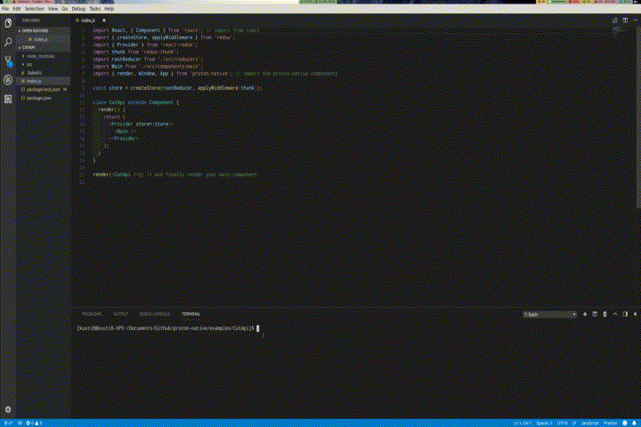

# V2 Changes

The following is written basically as a blog post of everything that it took to
get to V2. If you would rather skip ahead and just see the high level changelog,
click [here](#changelog)

## ToC

- [The Start](<#the\ start>)
- [Lack of Components](<#lack\ of\ components>)
  - [Native Components?](<#native\ components?>)
  - [Licensing?](#licensing?)
- [Difficult Layout](<#difficult\ layout>)
- [Lack of Styling](<#lack\ of\ styling>)
- [Difficult Installation](<#difficult\ installation>)
- [And finally, a little treat...](<#and\ finally,\ a\ little\ treat...>)
- [To get started](<#to\ get\ started>)
- [Note on Macs](<#note\ on\ macs>)
- [Changelog](#changelog)
- [Examples](#examples)
- [Contributions](#contributions)
- [What's Next?](<#<what's\ next?>)

## The Start

Proton Native was started two years ago when I was using React Native for mobile
apps, but wanted to write desktop apps. There was no tool available at the time,
so I decided to create my own. It is supposed to allow you to
write React code for desktop apps, without the need for Electron.
There was very little documentation on
working on the internals of React. `react-reconciler` had no documentation. The state
of GUI libraries on Node.js was abysmal, so I used `libui-node`.

This was the best look you could do, and while the code did work and it was React, it was not
similar to anything before it.



```jsx
class Main extends Component {
  render() {
    return (
      <App>
        <Window
          title="CatApi (Patent Pending)"
          size={{ h: 500, w: 500 }}
          menuBar={false}
          margined
        >
          <Box padded>
            <Form stretchy={false} padded>
              <TextInput
                stretchy={false}
                label="ID"
                onChange={id => this.props.setId(id)}
              />
              <Picker
                stretchy={false}
                label="Size"
                selected={sizeConsts.length - 1}
                onSelect={index => this.props.setSize(sizeConsts[index])}
              >
                {sizeConsts.map((s, i) => (
                  <Picker.Item key={i}>{s}</Picker.Item>
                ))}
              </Picker>
              <Picker
                stretchy={false}
                label="Type"
                selected={0}
                onSelect={index => this.props.setType(typeConsts[index])}
              >
                {typeConsts.map((s, i) => (
                  <Picker.Item key={i}>{s}</Picker.Item>
                ))}
              </Picker>
            </Form>
            <Button
              onClick={() => {
                this.props.search();
              }}
              stretchy={false}
            >
              Submit
            </Button>
            <TextInput stretchy={true} readOnly={true}>
              {this.props.url}
            </TextInput>
          </Box>
        </Window>
      </App>
    );
  }
}
```

After 2 years, some of the deficiencies of V1 started coming to light, which can mainly
be summarized in the following categories. All the rest of the changes stem from these problems.

- Lack of components
- Difficult layout
- Lack of styling
- Difficult installation

## Lack of Components

The Proton Native issue tracker was being flooded with requests for more components
so that people could do more with the tool. Already, the decisions I made in the
beginning were starting to show their effects. I used `libui-node` because at the
time it was the best GUI bindings for Node.js that I could find. It is based on
the `libui` library, a fantastic effort to create native components for all platforms.
Yet it is in alpha, and `libui-node` is slow to get updates from upstream.

I could not add more components because I was relying on an alpha library and was
not in control of the bindings. I wish `libui` the best, but Proton Native needed
a more mature library. The two major players in GUI libraries that offer good cross platform support and are very mature are Qt and wxWidgets. I chose to use Qt because of my familiarity with it, the ease of CSS styling, and the simple API.

There are no maintained Qt bindings for Node.js that I can find, and my experience with
`libui-node` left be a bit cautious about relying on other bindings. I decided
to create my own bindings, called `node-qt-napi`. These bindings very thin, but not meant to be entirely general purpose. Some functions are not wrapped because they are not used in Proton Native. A couple other custom functions are added to the bindings (such as image tiling) for Proton Native.

Yet this decision allowed development to be much faster because I could work with
Qt itself instead of with bindings. It also meant I can mirror the components of
React Native for a seamless transition to Proton Native.
Once work was done, I added a general layer sothat other libraries can be
seamessly added to Proton Native.

### Native Components?

Different GUI designers have different priorities. Some want something that looks pretty while others
want something that will ensure a great experience on every platform. Qt gives you the ability to
customize everything, and still has a pretty good experience with its components. But those components
are not native, meaning they are drawn by Qt instead of using the components provided by the OS.

Proton Native was mainly built to emulate React Native, which doesn't use many native components
for drawing. But native components on the desktop are important for some people and for that,
Proton Native V2 has two backends: Qt and wxWidgets.

Qt will always be the main backend, and right now the wxWidgets backend has very little components,
customizability, and is still experimental. It is actively being worked on to bring it up to par
with Qt (although it will never support the same easy styling as Qt). To use wxWidgets, see
the [dedicated page](wx_backend.md), but remember that it is still experimental.

### Licensing?

_Note that I am not a lawyer._

Licensing is always an issue when developing code. Qt is licensed under LGPL, a variation
on GPL. GPL by itself means that any changes must be made public. LGPL is a bit more
permissive, essentially saying that if the Qt binaries can be replaced your code can be closed source.
Proton Native is licensed under MIT and makes sure that it is always dynamically links
with Qt, so your code is free to be closed source if you so wish.

## Difficult layout

Layout was difficult on V1 due to using `libui` with its own layout system. I proposed
changes that would allow manual placement and resizing so that custom layout systems
could be used. However, this change demanded careful thought and was not ready
to be added at the time.

Qt brings its own layout system as well, but allows manual placement as a fallback.
With this available, I implemented `yoga-layout` so that users can place components
with the Flexbox system that they are accustomed to.

## Lack of Styling

V1 also lacked styling, so everything was themed basically. It was fine for basic
applications, but for more complex ones it made Proton Native very difficult to use.
Qt supports CSS styling, so this was relatively easy to implement, and now supports
almost the entire `style` object that React Native does.

## Difficult Installation

Almost a quarter of the bugs on the issue tracker stem from installation issues with
`libui-node`, especially on Windows. This presented a great barrier to usage. V2 uses
two C++ libaries, `yoga-layout` and `node-qt-napi`. Both of these come with prebuilt
binaries so that installation is seamless (you can always compile it yourself if you
so want). Proton Native uses `yoga-layout-prebuilt` for `yoga-layout` and compiles binaries for NAPI versions 2, 3, and 4 supporting all modern Node.js versions on
Linux, Mac and Windows.

## And finally, a little treat...

To make developing with Proton Native even easier, I've implemented hot reloading
with Proton Native V2. This is built into every starter application, as an
optional script that you can run. It's as easy as running `npm run dev` instead of
`npm run start`. Together with `webpack` and `react-proxy`, this means that changes
you make in the script will be immediately reflected in what you see, without changing
the state.

## To get started

Installation is simple with the `proton-native-cli` app.

```bash
# install the cli app
npm install -g proton-native-cli
# create your project
proton-native init my-app
# move to your project directory
cd my-app

# run your app
npm run start
# OR to run with hot reloading
npm run dev
```

## Note on Macs

Due to a bug in [libuv#2593](https://github.com/libuv/libuv/pull/2593) which Node.js uses ([reported in node#31328](https://github.com/nodejs/node/issues/31328)) Proton Native
does not work on Macs with Node versions >12.13.1 and >13.0.1. Until this is fixed,
it is recommended to use a Node version less than these (which can be easily
installed with `nvm`).

## Changelog

- Flexbox
  - Allows much easier styling and arrangement, that is the same as React Native
  - Uses yoga-layout
- Styling
  - Styling is now supported through Qt. This allows you to make your app look however you want.
- Qt instead of libui
  - Libui was moving slowly, new, and did not support many of the features needed
  - In the future, I will be moving towards true native components with wxWidgets, but it will take some time.
- Composition instead of inheritance
  - The code was remodeled to be less confusing and easier to change in the future
- Same components as React Native
  - We use the same components with the same props and the same look
  - This means that if you copy and paste your code, it should look the same
  - We still ensure that we don't make comprimises just for compatibility sake (like the ability to create multiple Windows)
- Hot Reloading
  - Allows quick developing for your apps.
- Improved Devtools support
  - The `react-devtool` support is now much more robust for better debugging.
- `proton-native-cli`
  - An entirely new management utility which allows for future additions if needed as well.
- Typescript
  - All of the code was converted over to Typescript to reduce bugs. The implementation needs to be better and more safe, but it works for now.

## Examples

There are plenty of examples in the examples folder to showcase what Proton Native
can do. Here's one of a calculator, modeled on the iOS calculator. The full code can be
found in the examples folder.


```jsx
class Calculator extends Component {
  // ...
  render() {
    return (
      <App>
        <Window style={{ width: 450, height: 900, backgroundColor: 'black' }}>
          <View
            style={{
              width: '100%',
              height: '30%',
              justifyContent: 'flex-end',
              alignItems: 'flex-end',
            }}
          >
            <Text
              style={{
                color: 'white',
                fontSize: 80,
                textAlign: 'right',
                marginRight: 35,
                marginBottom: 15,
                fontWeight: 200,
              }}
            >
              {this.state.primary.toString().length >= 7
                ? this.state.primary.toExponential(4)
                : this.state.primary}
            </Text>
          </View>
          {this.getButtons().map((buttonGroup, index1) => (
            <View
              key={index1.toString()}
              style={{
                flex: 1,
                flexDirection: 'row',
                justifyContent: 'space-evenly',
              }}
            >
              {buttonGroup.map((button, index2) => (
                <CircleButton
                  key={index1.toString() + index2.toString()}
                  {...buttonStyle[button.type]}
                  onPress={button.onPress}
                  width={button.width}
                  start={button.start}
                >
                  {button.text}
                </CircleButton>
              ))}
            </View>
          ))}
        </Window>
      </App>
    );
  }
}
```

## Proton Native vs. Others

Since Proton Native started, a lot of other projects have started with the same
objective. The goals of Proton Native are always to have an easy development
experience for the user, with plenty of documentation, ability to use tools
they are familiar with, and eventually be stable.

The most notable projects similar to Proton Native are `react-nodegui` and
`react-native-desktop`.

- `react-nodegui`
  - Aims to port Qt to React. Features an API similar to Qt, not to React Native.
  - Uses `qode`, a fork of `node`
  - Relatively good documentation
- `react-native-desktop`
  - A fork of React Native, to add desktop as a new target.
  - Means that React Native code should just work, but also means no support for windows, menus etc.
  - Relatively little documentation

## Contributions

Currently, Proton Native is headed by one high school senior with not enough time.
V2 took a lot longer than I would have liked it to. There is still a lot more work to
be done. PRs are always welcomed and I would love to advance this project as quickly
as possible.

If you don't want to contribute with code, you can also [sponsor me through GitHub](https://github.com/sponsors/kusti8).
However, there is no obligation on your part to sponsor.

## What's Next?

I look forward to improving Proton Native so that there is an easy way to create
apps with React on desktop. I am always open to suggestions, improvements, and
anything that can be done to make this project better. With that, the following items
are being planned.

- More components
  - Keep on adding more and more components so users can create apps more easily
- Add wxWidgets as a second backend
  - This will require serious work, due to the lack of CSS styling and my unfamiliarity with it, but this is an important improvement for user choice
- More props
  - Right now only the barebones props are supported for all the components. I would like to bring this in line with what React Native has.

Proton Native has a bright future, and I will continue to keep improving it. Thank you!
